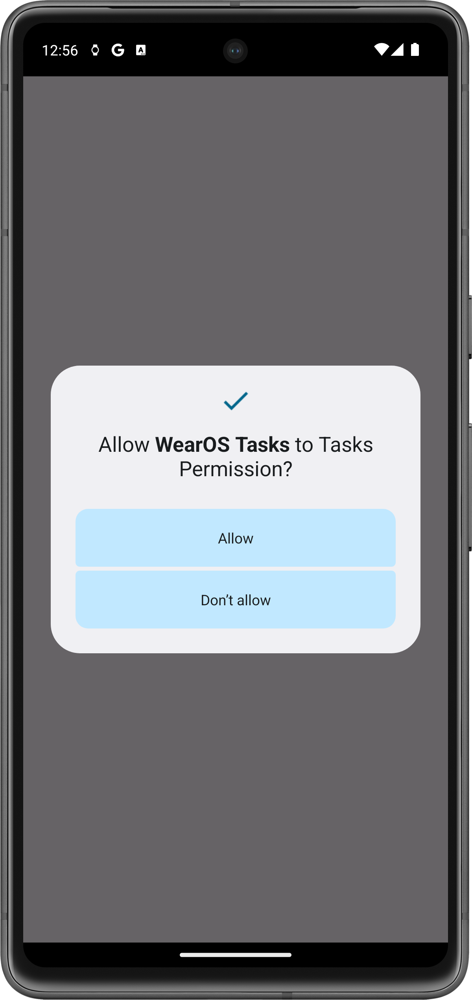
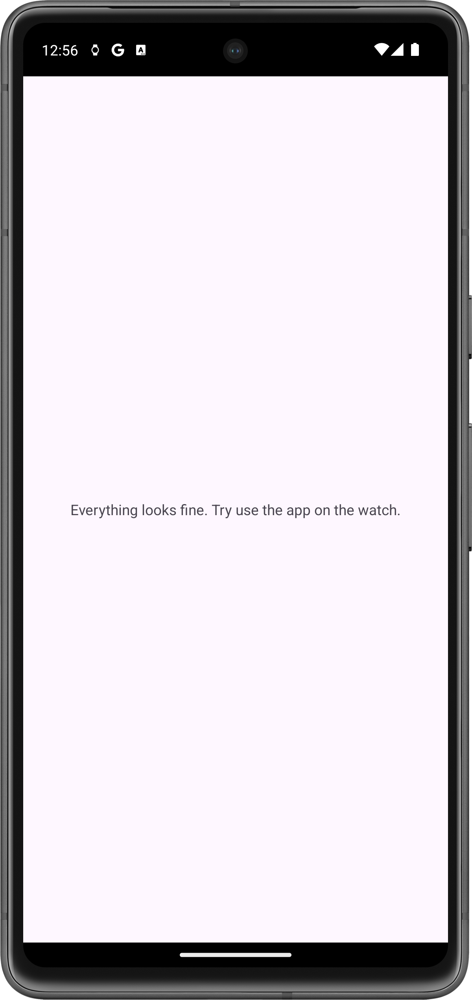

# Unofficial WearOS application for Tasks.org

This repository contains unofficial implementation of application for WearOS, that can show tasks from official application of Tasks.org. It needs application on your phone to communicate with, so you have to install both.

## What it can do

Right now it can list your today's uncompleted tasks. After tap on task, it will be marked as completed.

## Note

**Only tasks synchronized via DAVx5 are supported** right now, other tasks will not show up in the app.

**WearOS 3** and newer.

**Android 11** and newer.

## Warning

**This application is in very early stage of development, use at your own risk!**

## Screenshots

### Phone

|         Companion application asking for permissions         |       Companion application after permissions granted       |                Tasks in Tasks.org application                |
| :----------------------------------------------------------: | :---------------------------------------------------------: | :----------------------------------------------------------: |
|  |  |  |

### WearOS application

|  List of today's uncompleted tasks  | All tasks completed, nothing to show |
| :---------------------------------: | :----------------------------------: |
|  |    |

